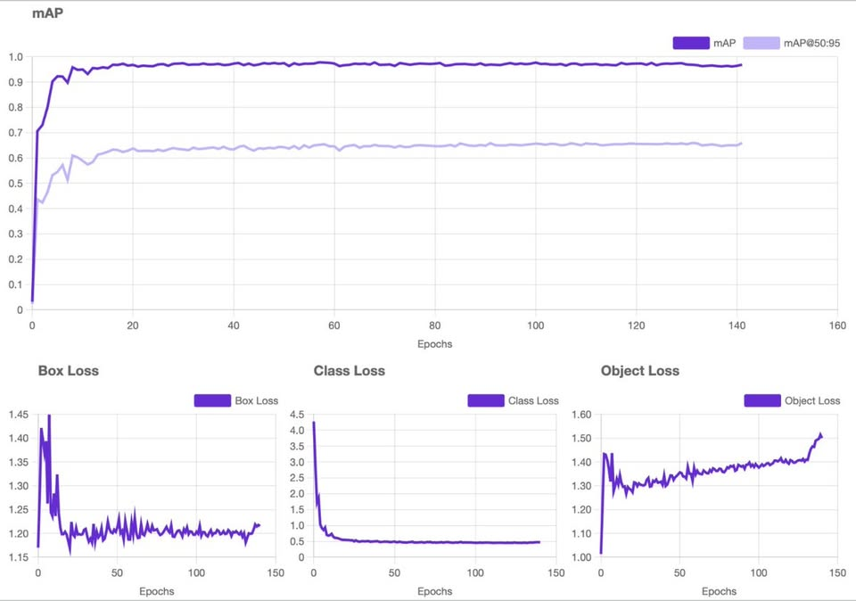
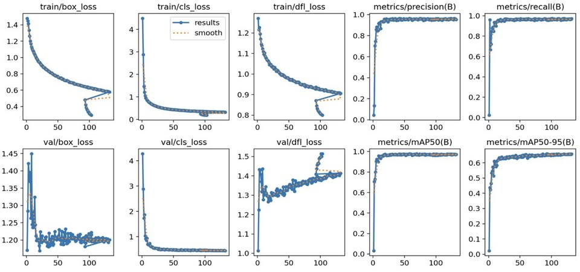
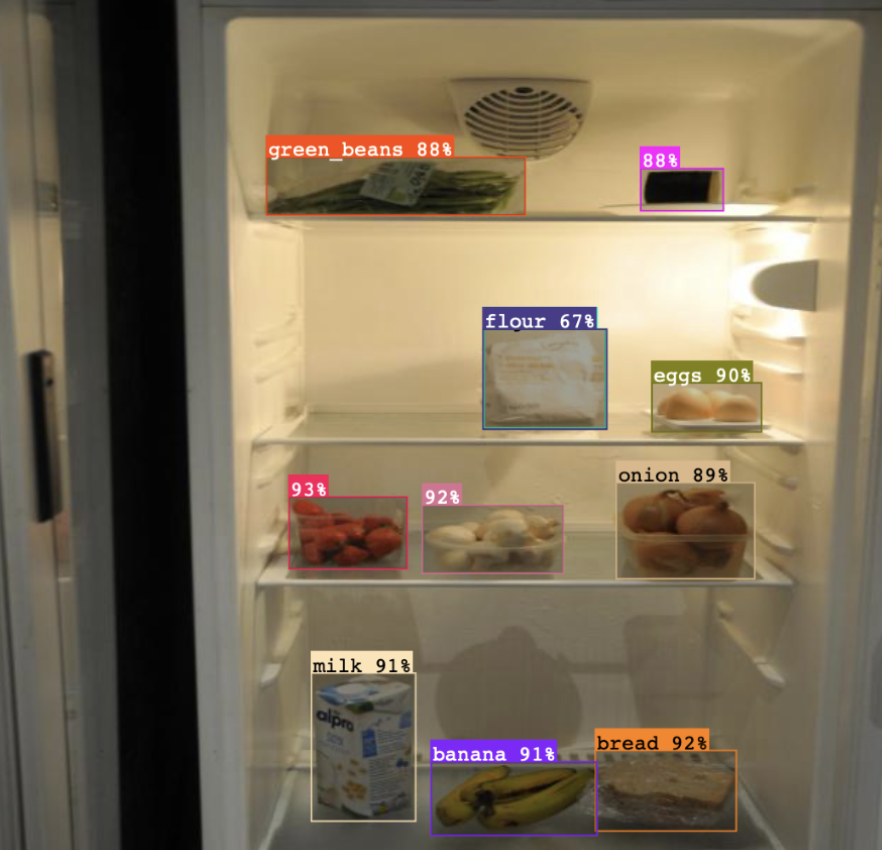

# 🍳 Meal Snap: Fridge-to-Fork AI

**Meal Snap** is an intelligent recipe generator that bridges the gap between the ingredients in your fridge and a delicious meal on your plate. By combining state-of-the-art **YOLOv12** object detection with AI-driven recipe generation, it simplifies meal planning and reduces food waste.

---

## 🚀 Overview
Upload a photo of your ingredients, tell the AI what you're craving, and receive instant, nutrition-aware recipes.

### Key Features
* **Smart Ingredient Detection:** Powered by **YOLOv12**, the model utilizes an attention-centric architecture to identify ingredients with high speed and accuracy.
* **Nutrition-Aware Outputs:** Every recipe includes calories, macros, and estimated cooking time.
* **Snowflake Powered:** High-performance data handling using Snowflake and Snowpark for recipe management.
* **Save & Revisit:** Logged-in users can maintain a personal library of their favorite cooking sessions.

---

## 🛠 Tech Stack
* **Object Detection:** YOLOv12 (Attention-Centric Real-Time Detector)
* **Database:** Snowflake (**BABI_DB**)
* **Backend:** Python (Snowpark, FastAPI)
* **Storage & Hosting:** GitHub Pages (Static JSON API)

---

## 📊 Model Performance
The model was trained for 140+ epochs, showing strong convergence and high precision in identifying household food items.

### Training Metrics & Loss
Our training process shows healthy downward trends in loss and rapid improvements in Mean Average Precision (mAP).

  

* **mAP@50:** Reached a plateau near **0.95+**, indicating extremely high reliability for general object detection.
* **Box Loss:** Measures how accurately the model locates the object boundaries. The sharp decline early on shows the model quickly learned spatial positioning.
* **Class Loss:** Tracks the accuracy of ingredient identification (e.g., distinguishing an onion from a potato).

### Detailed Validation Results

  

* **Precision & Recall:** Both metrics stabilized at high levels, ensuring the model misses very few items while maintaining high accuracy.
* **mAP@50-95:** The score above **0.6** indicates "laser sharp" localization accuracy across multiple thresholds.

---

## 🖼 Real-World Inference
In testing, the model successfully identifies multiple items in a standard fridge environment with high confidence scores, ranging from **67% to 93%** for complex items like flour, green beans, and milk.

  

---

## 📖 System Architecture
1. **Data Ingestion:** Data is pulled from Snowflake `BABI_DB.CXC.RECIPE_TABLE`.
2. **API Endpoint:** Latest recipes are pushed to a static JSON endpoint via GitHub Actions to ensure 24/7 availability.
3. **Inference:** The YOLOv12 model processes the image and combines detected classes with Snowflake data to draft the final recipe.

---

## 🤝 Contributing
Feel free to fork this repo and submit pull requests. For major changes, please open an issue first to discuss your ideas.
